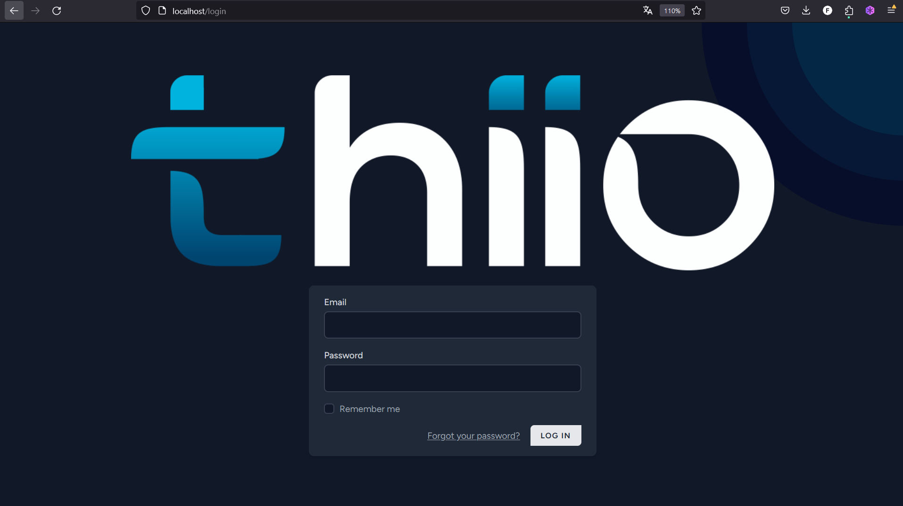
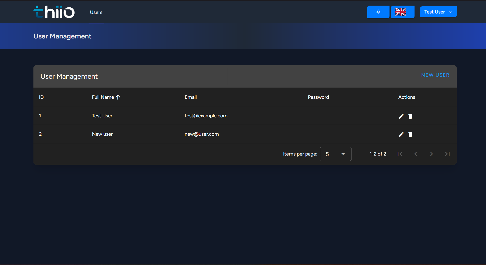
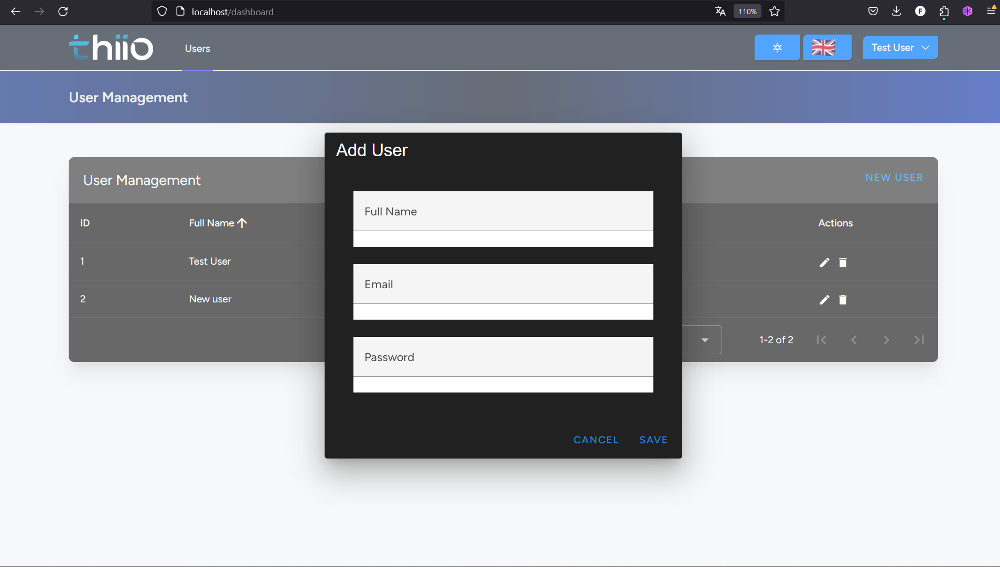
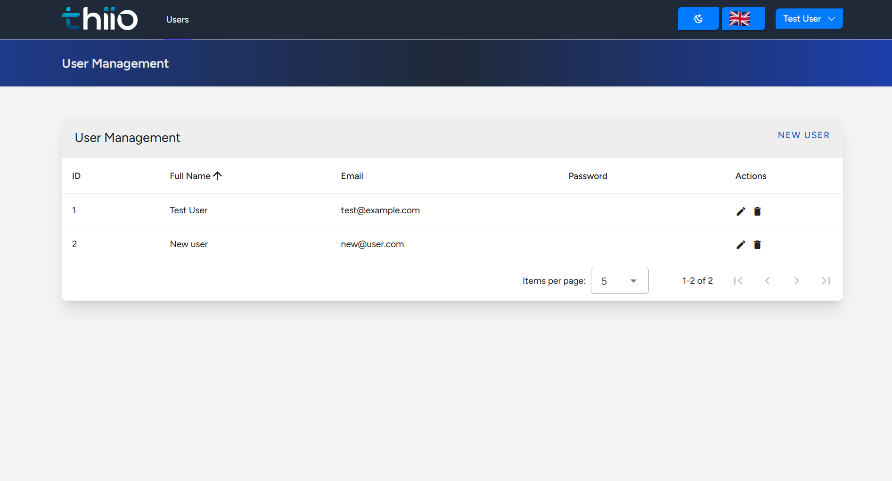

# README #

### Thiio CRUD ###

This CRUD Project was done for Thiio as a vacancy application for Full-stack developer.
As it name suggests, the current features of the projects are:
-Create Users
-Read Users
-Edit Users
-Delete Users
Alongside all the features that Laravel Jetstream offers, mainly in authentication.

## Installation

To install the project and get started:

```bash
curl -s https://laravel.build/thiio_crud_faagm_sail | bash
cd thiio_crud_faagm_sail
alias sail='sh $([ -f sail ] && echo sail || echo vendor/bin/sail)'
sail build --no-cache
sail composer install
sail npm install
sail artisan migrate
sail artisan db:seed
sail artisan key:generate
sail npm run build
```
finally go to the URL

```
http:\\localhost
```
and if you want to enter phpmyadmin then 

```
http:\\localhost:8080
```

### Browser Testing

For browser testing is used Laravel Dusk

> **_NOTE:_**  Only createTest was coded.

```bash
sail dusk
```

## Installation

Main technologies used for this project:
Linux / Ubuntu
Git / Github
MySQL / phpmyadmin
Docker
Laravel Sail
Laravel Dusk
Laravel 11 + Laravel Jetstream 5 + Inertia.js + Vue 3.js
Sass
Typescript
Vite.js
Laravel-vue-i18n (multilingual capabilities for the crud)
Vuetify 3.6


## Screenshots





